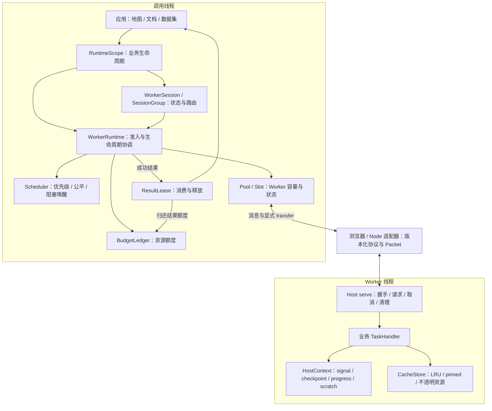
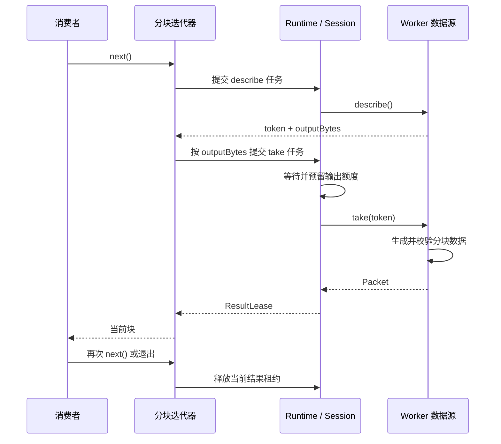

# tasklane 整体架构、模块与核心功能

本文依据当前仓库 `0.2.0-beta.2` 的源码整理。tasklane 是一个零运行时依赖的 TypeScript 任务运行时，在浏览器 Web Worker 和 Node.js `worker_threads` 上提供统一的任务执行与资源管理模型。

应用提供计算函数和 Worker 入口；tasklane 负责安排执行位置、控制并发和资源准入、传输输入输出，并在任务或业务生命周期结束时清理资源。GIS、图形、文件解析和 WASM 是可接入的业务场景，具体算法由应用实现。

## 阅读导航

- 第 1 节：整体分层、源码模块与公共入口。
- 第 2–5 节：业务生命周期、任务执行链路、调度和 Worker 管理。
- 第 6–8 节：数据传输、五类资源预算和结果背压。
- 第 9–12 节：取消、亲和性、Session 与 Worker 本地缓存。
- 第 13–15 节：通信协议、诊断和应用组织方式。
- 第 16–18 节：分块结果、动态资源维护和测试组织。

## 1. 设计目标

tasklane 面向高计算量、大数据和高交互应用，统一管理：

- Worker 生命周期
- 任务调度
- 资源准入
- 数据所有权
- 取消与超时
- 缓存亲和性
- 状态型 Session
- 结果背压
- 故障恢复与运行指标

整体结构如下。调用线程负责调度，业务计算运行在 Worker 内；每个 Worker 同时只执行一个物理任务。



### 源码模块

| 模块 | 源码 | 职责 |
| --- | --- | --- |
| 公共契约与入口 | [index.ts](../src/index.ts)、[types.ts](../src/types.ts) | 导出 Runtime、任务类型、预算、句柄、租约和消费工具；通过任务目录关联输入输出类型 |
| Runtime 编排 | [runtime/runtime.ts](../src/runtime/runtime.ts) | 实现 WorkerRuntime、RuntimeScope、WorkerSession、SessionGroup；协调准入、Worker 创建、任务状态、维护和关闭 |
| 调度器 | [runtime/scheduler.ts](../src/runtime/scheduler.ts) | 使用索引堆组织通道、组和优先级；维护公平服务顺序、可选老化和阻塞依赖 |
| Worker 执行端 | [host.ts](../src/host.ts) | `serve()` 注册处理函数，构造 HostContext，执行任务并校验输出；处理取消、进度确认和缓存清理 |
| 平台适配 | [adapters/browser.ts](../src/adapters/browser.ts)、[adapters/node.ts](../src/adapters/node.ts) | 将平台 Worker 包装成 WorkerEndpoint / MessagePortLike，统一消息、故障和物理终止接口 |
| 消息协议 | [protocol.ts](../src/protocol.ts) | 定义握手、请求、响应、取消、Scope 释放和缓存维护消息；校验协议标识、版本和 epoch |
| 数据编码与所有权 | [packet.ts](../src/packet.ts)、[binary.ts](../src/binary.ts)、[prepared-output.ts](../src/prepared-output.ts) | 编解码对象图与二进制数据、计量协议字节、检查 Blob 限额和 transfer；复用已准备的输出编码 |
| 预算账本 | [resources/budget.ts](../src/resources/budget.ts) | 校验、预留、归还五类额度，记录峰值，并执行交互类别预算保护 |
| 结果与常驻租约 | [resources/lease.ts](../src/resources/lease.ts)、[resources/resident.ts](../src/resources/resident.ts) | 结果延迟解码与释放；独立生命周期资源的额度申请、调整与归还 |
| Worker 资源 | [resources/cache.ts](../src/resources/cache.ts)、[resources/scratch.ts](../src/resources/scratch.ts) | 缓存命名空间、LRU、固定状态、不透明资源及异步 disposer；管理任务临时缓冲区 |
| 资源遥测 | [resources/telemetry.ts](../src/resources/telemetry.ts) | 校验资源缓存快照，维护命中、未命中、驱逐和回收计数；Runtime 汇总对外诊断 |
| 分块消费 | [iterate-results.ts](../src/iterate-results.ts)、[sized-results.ts](../src/sized-results.ts)、[sized-source.ts](../src/sized-source.ts) | 拉取式消费、逐块租约释放，以及先描述大小、再预留和生成数据的两阶段处理 |
| 错误与执行辅助 | [errors.ts](../src/errors.ts)、[remote-error.ts](../src/remote-error.ts)、[progress.ts](../src/progress.ts)、[yield.ts](../src/yield.ts)、[runtime/deferred.ts](../src/runtime/deferred.ts) | 统一错误、远端错误编码、进度数据校验、事件循环让出和内部 Promise 完成通知 |
| 测试适配 | [testing.ts](../src/testing.ts) | `createLoopback()` 提供同线程消息回环，保留真实 structuredClone / transfer 语义，并支持故障与消息注入 |

准入、亲和性注册、Pool / Slot 和运行统计由 `runtime.ts` 内部协调；表中的概念分层对应现有实现，未单独拆成服务。

### 包的四个公共入口

| 入口 | 使用位置 | 主要能力 |
| --- | --- | --- |
| `@mapseekai/tasklane` | 调用线程 | 创建 Runtime、浏览器 Worker 工厂、类型、计量、transfer、结果消费与迭代 |
| `@mapseekai/tasklane/host` | Worker 内 | `serve`、`output`、`browserHost`、Host 类型和 `createSizedResultSource` |
| `@mapseekai/tasklane/node` | Node 调用线程或 Worker | `nodeWorker`、`nodeEndpoint`、`nodeHost`；隔离 Node 专属依赖 |
| `@mapseekai/tasklane/testing` | 测试 | `createLoopback` |

## 2. Runtime 与 Scope

`WorkerRuntime` 是应用级执行器，负责多个 Worker Pool 的统一资源管理。

`Scope` 用于划分业务所有权，例如：

```text
runtime
├─ map-a
│  ├─ source-roads
│  └─ source-buildings
└─ map-b
   └─ source-raster
```

Scope 提供：

- 唯一身份
- 子 Scope
- 任务集合
- ResultLease 集合
- Worker 本地缓存命名空间
- 生命周期级清理

这种模型适合多地图、多文档、多数据集或多插件共享一个 Runtime。

## 3. 有界调度

调度分成两步：

```text
Task enqueue
    ↓
Admission
    ↓
prepare()
    ↓
Worker execute
    ↓
ResultLease
    ↓
consumer release
```

任务进入等待队列时只保存轻量描述。满足以下条件后才进入执行阶段：

- 活跃任务数有空位
- 对应 Pool 有可用 Worker Slot
- 输入额度充足
- 暂存额度充足
- 结果额度充足
- 非丢弃任务有可用租约名额

prepare 执行短小的同步输入构造；enqueuePrepared 将受预算约束的异步生产安排在 Worker 准入之前。队列中的闭包仍可能捕获用户数据，生产者也应采用有限提交窗口。预算管理申报量和协议数据，实际 JS 堆占用由应用结合运行环境测量。

### 一次任务的完整执行链路

1. 应用通过 Scope、Session 或 SessionGroup 提交任务名、输入构造函数和预算，立即获得 `TaskHandle`。
2. Runtime 校验参数并登记任务；Scheduler 按优先级、组公平性和通道顺序选出可以尝试准入的候选。
3. Runtime 检查 Worker、并发、预算和租约名额，预留任务额度；必要时启动 Worker，通过 `hello / ready` 完成握手。
4. 调用线程构造输入，编码成 Packet 并检查大小，通过 `request` 发给 Worker；只有显式列出的 transfer 对象才转移所有权。
5. Host 解码输入并调用对应处理函数。处理函数使用 HostContext 进行取消检查、进度上报、缓存访问和暂存分配。
6. Host 校验并发送结果；Runtime 结束物理任务，释放输入和暂存额度，将输出额度交由 ResultLease 持有。
7. 消费者读取 `lease.value` 时解码结果；调用 `release()` 后归还输出额度，唤醒等待资源的任务。

| 输入准备方式 | 执行位置 | Worker 占用 | 适用工作 |
| --- | --- | --- | --- |
| `enqueue` + `prepare` | 调用线程，同步 | 已分配 Worker，并占用 active 槽位 | 小型参数组装、任务自有缓冲区准备 |
| `enqueuePrepared` + `prepareAsync` | 调用线程，可异步 | 准备阶段尚未绑定 Worker | 文件读取、网络读取等异步生产 |

异步准备先预留任务预算和 `preparationScratchBytes`。`maxPreparingTasks` 同时限制正在准备和已经准备好、仍等待 Worker 的任务，默认值为 2。CPU 密集计算应放进 Worker handler；异步函数中的同步计算仍会阻塞调用线程。

## 4. 优先级与公平调度

支持三个任务优先级：

```text
interactive
foreground
background
```

典型场景：

| 优先级 | 场景 |
| --- | --- |
| interactive | 当前视口、拖动后的补数据、实时计算 |
| foreground | 用户主动执行的分析、导入、导出 |
| background | 预取、缓存构建、低优先级索引 |

调度器同时使用：

- 优先级
- 显式启用 ageing 时的等待提升
- Scope / group 上次服务序号
- 入队顺序

默认采用严格优先级；`priorityPolicy: 'ageing'` 才允许后台随等待时间提升到交互级别，两者均不抢占执行中的任务。

每个优先级/组/Pool 或 Session 通道维护 FIFO 索引堆，准入通过索引选择任务。空闲组历史有界保留，新组使用当前服务时钟，连续补交任务沿用服务历史参与公平调度。预算不足的等待者达到 `budgetWaitMs` 后，会保护其短缺额度，阻止小任务无限插队。

## 5. Worker Slot

每个物理 Worker 对应一个 Slot：

```text
Slot
├─ id
├─ epoch
├─ state
├─ current task
├─ optional session
├─ cache usage
└─ idle lifecycle
```

Slot 支持：

- 懒启动
- 协议握手
- 单物理任务执行
- 空闲回收
- Worker 代际
- 故障隔离

`epoch` 用于区分不同物理 Worker 实例，避免迟到消息与新实例任务发生关联。

## 6. 数据所有权与 Transferable

高性能路径使用任务自有 `ArrayBuffer`：

```text
prepare()
   │
   ▼
owned ArrayBuffer
   │ transfer
   ▼
Worker
   │ transform
   ▼
owned Result Buffer
   │ transfer
   ▼
ResultLease
```

`transferBuffers()`：

- 对完整 `ArrayBuffer` 去重
- 接受完整 backing store 的 TypedArray
- 显式表达所有权转移

适合坐标数组、像素块、压缩数据、二进制文件分片等大数据结构。

## 7. 资源预算

Runtime 使用 `BudgetLedger` 管理五类资源；其中 TaskBudget 申报输入、暂存和输出三项：

```text
inputBytes
scratchBytes
outputBytes
cacheBytes
residentBytes
```

### 输入预算

输入预算在同步调用 `prepare()` 前预留，发送前检查 `packetByteLength`：包含二进制 backing store、字符串以及扁平对象图编码的元数据。复合 TypedArray 包需要同时申报 buffer 和元数据空间。

### 暂存预算

`scratchBytes` 在准入时预留。`ctx.scratch.allocate(bytes)` 提供受限的临时 ArrayBuffer，release 或任务结束会 detach 全部别名。以下直接分配由应用估算和管理：

- JSON 解析对象
- WASM heap
- 解压缩工作区
- 几何中间数组

### 结果预算

结果预算在任务准入时预留，Host 编码、校验后才发送，Runtime 接收时只检查封装和字节数。首次访问 `lease.value` 才解码对象图；调用 `release()` 归还额度，`discardResult` 可不解码直接释放。

这种设计让消费者速度参与上游调度，形成自然的结果背压。

### 缓存预算

`cacheBytes` 用于 Worker 内的长期缓存：

- 三角化结果
- 解码块
- 字体数据
- 索引
- WASM 运行时缓存

### 常驻资源预算

`residentBytes` 用于任务之外、具有独立生命周期的资源费用，通过 Runtime、Scope 或 Session 的 `resources.acquire({ kind: 'resident', bytes })` 申请。返回的 ResourceLease 支持 `resize()` 和 `release()`；`acquireSession()` 也可在申请 Worker 时一并预留常驻额度。

常驻租约负责额度记账，资源所有者负责先销毁实际数据、再归还额度。Worker 中通过 `setResource()` 注册的资源使用所在 Worker 的 cache 额度，并携带 disposer；两者的归属与清理机制不同，应按实际持有的数据申报。

### 各类额度何时释放

| 额度 | 持有阶段 | 释放条件 |
| --- | --- | --- |
| input / scratch | 获得预算后到物理工作完成 | Runtime 确认执行结束；异步准备取消后仍需等待生产函数退出 |
| output | 任务准入、执行和结果消费 | 失败或丢弃时归还，成功结果由租约释放时归还 |
| cache | Worker 驻留和缓存维护 | 缩容收到 Host 确认，或物理 Worker 终止完成；删除单个条目仅降低本地使用量 |
| resident | 显式资源租约生命周期 | 租约缩小或释放，或所属生命周期完成清理 |

这些额度约束协议数据和申报资源。任意 JS 对象、WASM 堆、GPU 分配以及应用保留的外部引用仍需应用自行管理。

## 8. ResultLease

任务成功后返回：

```ts
interface ResultLease<T> {
  readonly value: T;
  readonly byteLength: number;
  readonly released: boolean;
  release(): void;
}
```

ResultLease 将“任务完成”和“消费者完成使用结果”分开。

典型链路：

```text
Worker finished
    ↓
ResultLease
    ↓
consumer processing
    ↓
release()
    ↓
output budget available
```

使用 `consumeResult(handle, consume)` 确保消费结束后释放，包括消费者抛错的路径。`settled` 只等待物理完成；仅需完成通知应显式 `discardResult: true`。`maxResultLeases` 和 `maxScopes` 分别限制未释放结果与 Scope 数量。

## 9. 取消模型

提供三种取消策略。

### cooperative

主线程发送取消消息，Worker 任务通过 `AbortSignal` 和 `checkpoint()` 响应。

适合：

- 可分块循环
- 异步解析
- 分阶段算法
- 可周期性检查信号的 WASM 封装

### discard

调用方立即结束等待，物理任务继续运行直到完成，结果随后丢弃。

适合：

- 执行时间较短
- 算法本身同步
- Worker 缓存结果仍具有潜在复用价值

### terminate

终止任务所在的物理 Worker，并通过新 Worker 继续后续任务。

适合：

- 长时间同步算法
- 可安全重建 Worker 状态
- 大计算需要快速释放 CPU

## 10. Affinity

软亲和性用于提高 Worker 本地缓存命中率：

```ts
affinity: 'dataset-a/shard-17'
```

调度器优先选择此前处理过相同 affinity 的 Worker。

适合：

- 分块几何缓存
- 字体缓存
- 解码缓存
- 数据分片缓存

## 11. Session

Session 提供独占 Worker 的严格亲和性：

```ts
const session = scope.session('database');
```

生命周期：

```text
unbound
   ↓ first task
bound
   ↓ worker lost
lost

bound
   ↓ dispose
closed
```

适合：

- DuckDB / SQLite
- GDAL dataset
- 长驻 WASM instance
- 数据库连接
- 带内部状态的解析器

Session Worker 专属于一个会话，使状态与执行环境保持稳定对应。

### 显式准入与回收

`scope.session(pool)` 创建惰性 Session，首个任务才绑定 Worker。`await scope.acquireSession(pool, options)` 提前完成 Worker 准入与启动，可同时申请 `residentBytes`；`mode: 'immediate'` 在容量不足时拒绝，`mode: 'wait'` 等待容量，并支持信号取消与超时。

Session 默认保留状态。显式设置 `reclaimable: true` 后，空闲且没有排队任务、持有结果等保护条件的 Session 才可参与回收；`reclaimPriority` 和最近使用顺序决定候选次序。Worker 丢失后 Session 进入 `lost`，应用负责重新打开数据库、数据集或 WASM 状态。

### SessionGroup 路由

`scope.sessionGroup(sessions)` 借用同一 Runtime、Scope、Pool 和准入优先级的已绑定 Session。组任务从可用成员中，优先选择上报缓存 key 与任务 `affinity.keys` 交集较多的 Worker，同分时选择最久未使用的成员。

应用应先初始化各个成员，确保它们能处理同一组业务请求。组负责路由，成员的创建、状态初始化和销毁仍由应用管理；普通 Session 提交的任务继续绑定其专属 Worker。

## 12. Worker 本地缓存

Host 提供：

```ts
ctx.cache.get(key)
ctx.cache.set(key, value, bytes)
ctx.cache.setPinned(key, value, bytes)
await ctx.cache.delete(key)
```

普通缓存采用有界 LRU。

`setPinned()` 仅保存可检查的普通数据。数据库、WASM、数据集句柄等不透明实例使用 `setResource(key, value, bytes, disposer)`，声明资源费用并提供异步清理函数。`await cache.delete(key)` 在清理完成后归还额度；失败保留条目，允许重试。硬终止路径的外部资源清理由应用恢复策略负责。

缓存同时控制：

- 总字节数
- 条目数量
- Scope / Session 命名空间

## 13. 协议

协议版本为 7，Runtime 与 Host 必须使用同一版本。v7 为数组连续元素使用按位置编码的 items，空洞后的元素和自定义属性仍使用 props。消息还携带 Worker epoch：

```text
hello
ready
request
progress
progress-ack
result
error
cancelled
cancel
release-scope
released
cache-control
cache-controlled
```

握手阶段由 Worker 返回支持的任务列表，Runtime 根据任务能力进行准入。

请求消息包含：

```text
tag
version
epoch
id
scope
session (optional)
task
payload (Packet)
maxOutputBytes
maxScratchBytes
```

progress 仅承载 4 KiB 内的小型控制数据，最多单条在途，收到 progress-ack 后才能继续发送；阻塞期间只保存最新快照。任务结束后 context 关闭。

Scope 销毁按 scope/epoch 等待 released 确认，超时或清理失败会拒绝；Session 正常关闭等待 disposer，失败保留 Worker 供重试。物理 terminate 失败保持隔离和额度，通过 `retryTermination()` 重试，资源释放以物理完成确认为准。

缓存控制在业务任务物理完成后执行；缩容 ACK 到达才归还全局额度，扩容先申请差额。终态与释放/控制 ACK 携带有界资源计数及 footprint 快照，供 SessionGroup 路由和可选自适应控制使用。资源预留、阻塞索引和维护边界见 [资源调度指南](resource-scheduling.md)。

自定义 endpoint 应运行可信代码，并在发送前遵守协议与额度约束。接收侧先完成原生消息反序列化，再执行协议校验；进程级内存限制由运行环境提供。

## 14. 可观测性

每个任务提供：

```text
queueMs
startupMs
prepareMs
roundTripMs
workerMs
totalMs
```

Runtime 统计包括：

```text
queued
active
workers
closingWorkers
quarantinedWorkers
scopes
leases
workerStarts
workerTerminations
inputBytes
outputBytes
reserved
peakReserved
cacheUsedBytes
```

这些指标适合定位：

- Worker 数量配置
- 排队拥塞
- 输入准备成本
- 数据通信成本
- 算法执行成本
- 消费者背压
- 缓存占用

## 15. 推荐的应用结构

```text
Application
│
├─ Runtime
│  │
│  ├─ compute pool
│  │  ├─ geometry
│  │  ├─ projection
│  │  └─ format conversion
│  │
│  ├─ raster pool
│  │  ├─ decode
│  │  └─ resample
│  │
│  └─ stateful sessions
│     ├─ database
│     └─ wasm runtime
│
└─ consumers
   ├─ UI
   ├─ renderer
   ├─ storage
   └─ export pipeline
```

该结构适合持续扩展插件、数据格式和计算能力，同时保持 Worker 管理方式统一。

## 16. 拉取式分块结果

分块结果将大数据处理拆成有限大小的任务，让消费者的处理速度直接约束下一块的生产。

- `iterateResults()` 每次拉取一个 TaskHandle，持有当前结果租约；下一次拉取、退出迭代或取消时释放当前租约，关闭时等待物理任务完成并调用应用提供的 `close()`。
- `iterateSizedResults()` 先执行小型描述任务获取 `token / outputBytes`，校验 `maxChunkBytes`，再按该上界申请结果额度并提交 Session 任务。
- Worker 端 `createSizedResultSource()` 最多保留一个待消费计划；`describe()` 返回元数据，`take()` 在已获得输出额度后调用计划的 `encode()`，之后释放计划状态。



描述阶段保留的 reader / 计划状态需计入所属 Session 的资源费用。迭代关闭函数应按所有权关闭游标或 Session；借用的 Session 由其所有者管理。清理失败可通过 `retryCleanup()` 显式重试。接入细节见 [文件、Session 与分块结果](file-and-session.md)。

## 17. 交互资源预留与动态维护

### 交互资源预留

`interactiveReserve` 可以为交互类任务保留全局 Worker、执行槽位、准备窗口、结果租约及字节额度；池级 `interactiveWorkers` 控制该池的 Worker 类别容量。两项默认均不预留。

非交互任务只能使用扣除预留后的容量；交互任务可使用总容量。优先级老化只改变排队顺序，不改变资源类别。预留不会抢占正在执行的计算，因此响应时间还取决于任务分块和已有执行负载。

### 手动维护与压力反馈

| 接口 | 作用 |
| --- | --- |
| `resizePool()` | 调整池的容量和每 Worker 缓存目标，受构造时硬上限约束 |
| `trim()` | 主动缩减缓存和空闲 Worker，可配置是否回收允许回收的 Session |
| `setMemoryPressure()` | 应用报告 normal / moderate / critical 压力，触发目标调整与安全回收 |
| Pool 的 `adaptive` | 显式启用后，依据排队、缓存反馈和空闲时长，在配置范围内调整目标 |

Runtime 根据维护屏障串行协调清理，忙碌 Worker 可延迟缩容。缓存缩容收到 ACK 后才归还全局额度；物理终止失败时继续保留占用。通过 `MaintenanceReport` 查看本次维护结果，通过 `diagnostics()` 对比目标与实际占用。

压力级别由应用提供；自适应控制依赖排队和资源上报信息。详细配置、默认值和回收条件见 [资源调度指南](resource-scheduling.md)。

## 18. 可观测性与验证入口

排查一个任务为何没有执行，可先查看 `diagnostics().waiting`：区分 Worker 容量、准备窗口、输入输出预算、结果租约、Session 状态和维护屏障等阻塞原因，再结合任务 timing 判断开销位于排队、准备、执行还是通信。

`stats` 提供整体任务与资源计数；池诊断补充缓存命中、资源上报快照和回收原因。`onDiagnostic` 接收运行维护中的错误，观察回调自身的异常与任务执行隔离。

| 目录或入口 | 验证内容 |
| --- | --- |
| `test/*.test.mjs` | 调度、预算、协议、取消、Session、维护、结果迭代和故障回归 |
| `test/contracts.ts` | 公共 API 的 TypeScript 类型契约 |
| `test/browser/` | Chrome、Firefox、WebKit 中的真实 Worker 行为 |
| `test/stress/` | 大数据处理、取消和清理压力场景 |
| `scripts/package-smoke.mjs` | 包导出与安装使用检查 |
| `benchmarks/` | 调度、缓存、协议、常驻资源和阻塞队列等专项性能测量 |
| `examples/` | 浏览器和 Node 接入示例 |

Loopback 适合可控故障和协议检查，真实并行执行与性能应通过平台 Worker 验证。本文为源码架构说明；历史验证记录见 [测试与验收](testing.md)，测量条件与结果见 [性能测试](performance.md)。
